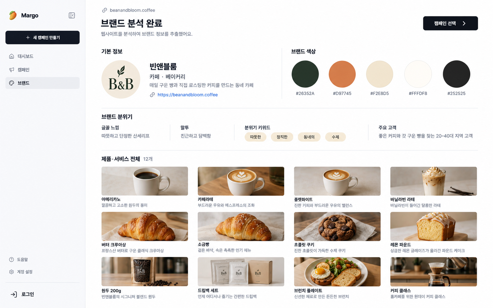

# 스킬 1: 브랜드 정보 수집

이 문서의 스킬은 Codex나 AI 에이전트용 스킬이 아니라 Trainthon 제품 기능의 이름이다.

## 목적

사용자가 입력한 사이트 URL을 분석해 브랜드 에셋 화면과 이후 콘텐츠 생성에 사용할 브랜드 프로필을 만든다.

## 화면 시안



## 입력

- 웹사이트 URL 1개

## 수집 결과

### 1. 기본 정보

- `name`: 브랜드명. 반드시 있어야 한다.
- `industry`: 업종. 확인할 수 없으면 `null`
- `tagline`: 사이트 내용을 바탕으로 정리한 한 줄 소개. 확인할 수 없으면 `null`
- `source_url`: 사용자가 입력한 사이트 주소

### 2. 로고

- `logo_url`: 사이트에서 사용하는 대표 로고 이미지 주소
- 대표 로고를 찾을 수 없으면 `null`로 처리한다.
- 파비콘, 푸터 로고, 이벤트 로고를 대표 로고로 잘못 선택하지 않는다.

### 3. 브랜드 색상

- `palette[]`: 로고, CSS, 주요 버튼과 배경에서 반복되는 브랜드 색상
- 색상은 `#RRGGBB` 형식으로 통일한다.
- 단순한 본문 글자색처럼 브랜드를 나타내지 않는 색은 제외한다.
- 확인할 수 있는 브랜드 색상이 없으면 빈 배열 `[]`을 사용한다.

### 4. 브랜드 분위기

- `font_feel`: 글꼴이 주는 인상. 확인할 수 없으면 `null`
- `voice`: 사이트 문구에서 드러나는 말투. 확인할 수 없으면 `null`
- `mood_keywords[]`: 브랜드 분위기를 나타내는 짧은 키워드
- `target_audience`: 제품·서비스와 사이트 문구로 확인되는 주요 고객. 확인할 수 없으면 `null`

분위기는 사이트의 글, 색상, 이미지, 레이아웃을 근거로 작성한다. 근거가 부족하면 추측하지 않는다. 분위기 키워드를 확인할 수 없으면 빈 배열 `[]`을 사용한다.

### 5. 제품·서비스 전체

사이트에 현재 제품 또는 서비스로 적힌 항목을 개수 제한 없이 모두 수집한다.

각 항목:

- `name`: 제품 또는 서비스 이름
- `image_url`: 대표 이미지 주소. 이미지가 없으면 `null`
- `description`: 사이트에 적힌 설명을 짧게 정리한 내용. 설명이 없으면 `null`
- `price`: 사이트에 표시된 가격. 가격이 없으면 `null`

수집 범위:

- 홈페이지의 제품·서비스 목록
- 같은 사이트 안의 메뉴, 카테고리, 상품 목록, 서비스 소개 페이지
- 페이지 번호, 더 보기, 무한 스크롤 뒤에 있는 항목
- 품절이어도 현재 사이트 목록에 남아 있는 항목

제외 범위:

- 블로그, 뉴스, 채용, 이용약관에만 등장하는 항목
- 외부 판매처에만 있는 항목
- 단종 또는 과거 제품 전용 보관 페이지
- 색상·크기 같은 옵션만 다른 동일 제품

같은 항목이 여러 페이지에 반복되면 하나로 합친다. 서로 다른 메뉴, 모델, 요금제 또는 패키지는 각각 별도 항목으로 수집한다.

## 출력 형식

```ts
{
  name: string,
  tagline: string | null,
  industry: string | null,
  logo_url: string | null,
  palette: string[],
  font_feel: string | null,
  voice: string | null,
  mood_keywords: string[],
  products: Array<{
    name: string,
    image_url: string | null,
    description: string | null,
    price: string | null,
  }>,
  target_audience: string | null,
  source_url: string,
  analyzed_at: string, // UTC ISO 8601, 예: 2026-09-09T10:30:00Z
}
```

제품과 서비스는 모두 `products[]`에 담는다. 현재 `docs/PLAN.md`에 없는 필드는 추가하지 않는다.

## 실패 처리

- 사이트를 읽을 수 없으면 빈 브랜드 프로필을 반환하지 않고 분석 실패로 처리한다.
- 일부 페이지가 차단되거나 제품·서비스 목록의 끝까지 확인되지 않으면 부분 프로필을 반환하지 않고 분석 실패로 처리한다.
- 실패 원인은 사용자에게 그대로 보여 준다.
- 값을 찾지 못한 필드는 위에서 정한 `null` 또는 `[]`로 처리하고 임의로 채우지 않는다.

## 완료 기준

1. 기본 정보, 로고, 색상, 분위기를 확인했다.
2. 같은 사이트에서 연결된 제품·서비스 목록을 모두 탐색했다.
3. 페이지 번호, 더 보기, 무한 스크롤의 끝을 확인했다.
4. 중복을 제거한 전체 제품·서비스가 `products[]`에 들어갔다.
5. 실패하거나 일부만 수집된 경우 그 사실을 숨기지 않았다.
